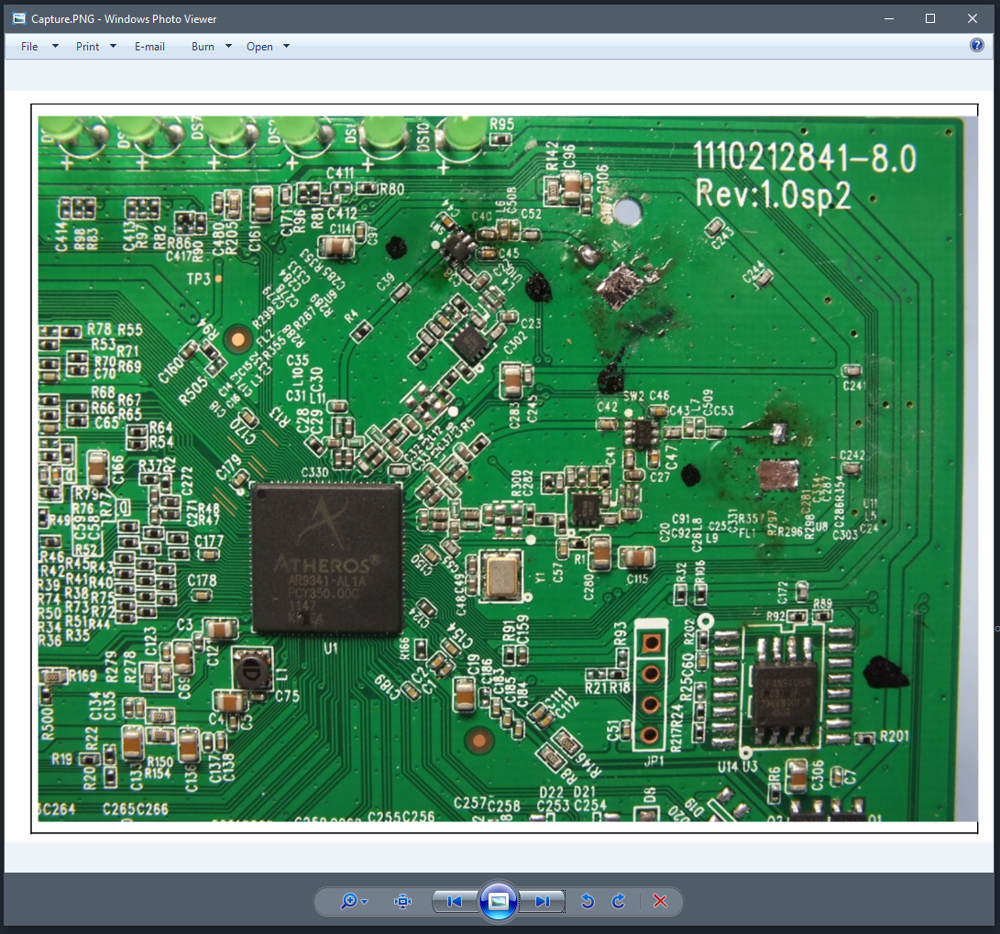

# Restore Windows Photo Viewer

This repository contains registry files to restore the classic Windows Photo Viewer on Windows 10 and later versions. The provided `.reg` files can be used to enable or disable the Windows Photo Viewer for all users or the current user.

## Files

- `Restore the Windows Photo Viewer ALL USERS.reg`
- `Restore the Windows Photo Viewer CURRENT USER.reg`
- `UNDO Restore the Windows Photo Viewer ALL USERS.reg`
- `UNDO Restore the Windows Photo Viewer CURRENT USER.reg`

### Restore the Windows Photo Viewer ALL USERS.reg

This file restores the Windows Photo Viewer for all users on the system. It modifies the registry keys under `HKEY_CLASSES_ROOT` to associate various image file types with the Windows Photo Viewer.

### Restore the Windows Photo Viewer CURRENT USER.reg

This file restores the Windows Photo Viewer for the current user only. It modifies the registry keys under `HKEY_CURRENT_USER\SOFTWARE\Classes` to associate various image file types with the Windows Photo Viewer.

### UNDO Restore the Windows Photo Viewer ALL USERS.reg

This file undoes the changes made by `Restore the Windows Photo Viewer ALL USERS.reg`. It removes the registry keys and values that were added to restore the Windows Photo Viewer for all users.

### UNDO Restore the Windows Photo Viewer CURRENT USER.reg

This file undoes the changes made by `Restore the Windows Photo Viewer CURRENT USER.reg`. It removes the registry keys and values that were added to restore the Windows Photo Viewer for the current user.

## Usage

### Restoring Windows Photo Viewer

1. Double-click the `Restore the Windows Photo Viewer ALL USERS.reg` file to restore the Windows Photo Viewer for all users.
2. Double-click the `Restore the Windows Photo Viewer CURRENT USER.reg` file to restore the Windows Photo Viewer for the current user.

### Undoing the Changes

1. Double-click the `UNDO Restore the Windows Photo Viewer ALL USERS.reg` file to undo the changes for all users.
2. Double-click the `UNDO Restore the Windows Photo Viewer CURRENT USER.reg` file to undo the changes for the current user.

## Notes

- Administrator privileges may be required to apply the changes for all users.
- Always back up your registry before making any changes.
- Use these files at your own risk. The author is not responsible for any damage caused by using these files.

## License

This project is licensed under the MIT License. See the LICENSE file for details.